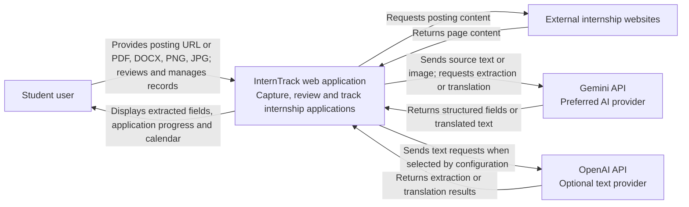

# D1 — InternTrack System Context

Scope: InternTrack includes its database; external AI providers and posting websites sit outside its boundary.

The student supplies files; a file is an input, not a separate human actor. Employers do not operate InternTrack in the current scope. Applying to an employer occurs outside this system. Authentication, automatic application submission and outbound reminders are not included in this baseline.

Evidence: `README.md`; `.docs/01-requirements/spec.md` F1–F12 and scope exclusions; `web/app/api/extract/route.ts`.