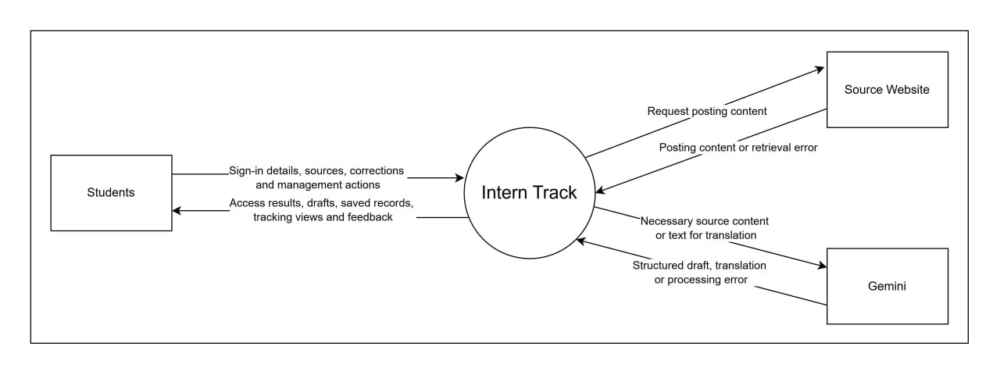

# D1 — System Context

## Scope

InternTrack is shown as one system.

The Student is the primary actor.
Source Website and Gemini are external systems.

This diagram describes the whole-system design.
Implementation and verification status are recorded in the backlog.

## System Context Diagram

## Student Interactions

The Student uses InternTrack to:

- Sign in and sign out.
- Manage a profile.
- Submit internship URLs or supported files.
- Review and correct extracted drafts.
- Save, search, reopen and delete records.
- Manage status, priority, checklists and notes.
- Track deadlines, follow-ups and interviews.
- Translate supported fields into English.

## System Boundaries

- Authentication and authorization are handled within the system boundary.
- An external identity provider should be added only if selected.
- PostgreSQL is internal and appears in D3.
- Uploaded files are inputs supplied by the Student.
- Gemini is the sole AI provider.
- AI output requires Student review before saving.
- External processing must follow data-minimization rules.

## Outside the Current Product Scope

- Employer and career-staff accounts.
- Sharing records with other users.
- Outbound email or push notifications.
- Payments, messaging and electronic signatures.
- Employer or university-system integrations.

## Traceability

- F1: Profile management.
- F2–F6: Capture, extraction, review, saving and duplicates.
- F7–F10: Tracking, preparation, dates and search.
- F11: Translation.
- F12: Deletion.
- F13: Authentication and session access.
- LR2: External AI processing.
- LR4: Ownership and personal-data rights.
- NFR3: Security and access boundaries.

## Related Diagrams

- [D2 use cases](D2-use-case.md)
- [D3 architecture](D3-architecture.md)
- [D4 sequence](D4-activity.md)