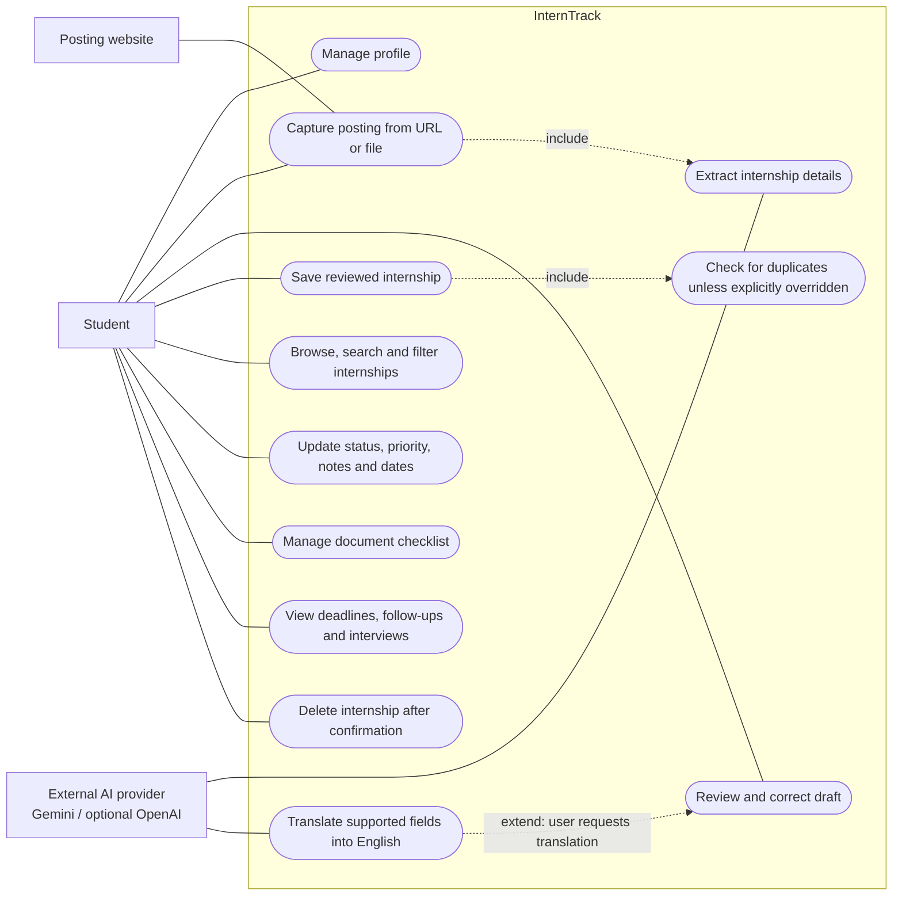

# D2 — InternTrack Use Cases

Mermaid flowchart notation represents actors, oval use cases and the system boundary. This is a use-case view, not a sequence of screens.

- Capture/extract/review/save: F2–F6.
- Profile: F1. Lifecycle and preparation: F7–F8. Calendar: F9.
- Browsing: F10. Optional translation: F11. Deletion: F12.
- A duplicate warning allows viewing the existing record or explicitly adding another. Translation is optional; reviewing before saving is part of the core workflow.
- Document checklist entries represent preparation tasks, not a document-storage service. No login or email-reminder use case is claimed for the demo build.

Evidence: `.docs/01-requirements/spec.md`; `web/app/api/internships/route.ts`; `web/prisma/schema.prisma`.
