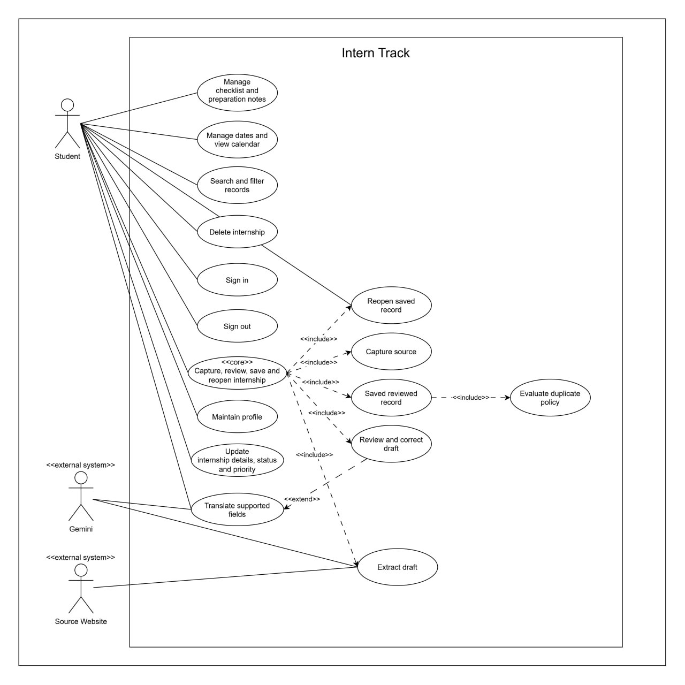

# D2 — Use Cases

## Scope

This diagram describes the whole system.

The Student is the primary actor.
Source Website and Gemini are external systems.

One core workflow is marked:
capture → extract → review → save → reopen.

Implementation and acceptance status remain in the backlog.

## Use-Case Diagram

## Interpretation

- Solid lines connect actors to use cases.
- `<<include>>` identifies required behavior.
- `<<extend>>` identifies optional behavior under a condition.
- Optional translation extends draft review.
- Translation may also be used from supported saved-record screens.
- Reopening is part of the core workflow and can occur independently.
- Source Website participates when the input is a URL.
- Uploaded files are inputs, not actors.
- Gemini is the sole AI provider.

The core use case describes the successful capture-to-reopen goal.
Cancellation and failures are alternative paths.

This diagram does not show step order. D4 shows the interaction sequence.

## Authentication and Ownership

- The Student signs in before using protected features.
- A valid session may support several actions.
- Sign-in is not repeated as an included use case for every action.
- The server checks access to records and related data.
- Sign-out invalidates the relevant session.
- Shared demo identity does not provide authenticated isolation.

## Traceability

- Sign In / Sign Out: F13; B13.
- Capture Source: F2; B02.
- Extract Draft: F3; B03.
- Review and Correct: F4; B04.
- Save / Reopen: F5; B05.
- Evaluate Duplicate Policy: F6; B06.
- Maintain Profile: F1; B10.
- Update Details, Status and Priority: F7; B01, B07.
- Checklist and Preparation Notes: F8; B08.
- Dates and Calendar: F9; B09.
- Search and Filter: F10; B20.
- Translate Fields: F11; B11.
- Delete Internship: F12; B23.

Privacy, retention and access-control requirements apply across
these use cases. They are detailed in the specification and rules.

## Scope Boundaries

Sharing, employer/staff accounts, outbound notifications, payments,
messaging and signatures are outside the defined product scope.

The diagram describes required behavior, not verified completion.
Check rendering and consistency with the specification before submission.

## Related Documents

- [Specification](../../01-requirements/spec.md)
- [Backlog](../../01-requirements/backlog.md)
- [User journey](../user-journey.md)
- [D1 system context](D1-system-context.md)
- [D3 architecture](D3-architecture.md)
- [D4 sequence](D4-activity.md)