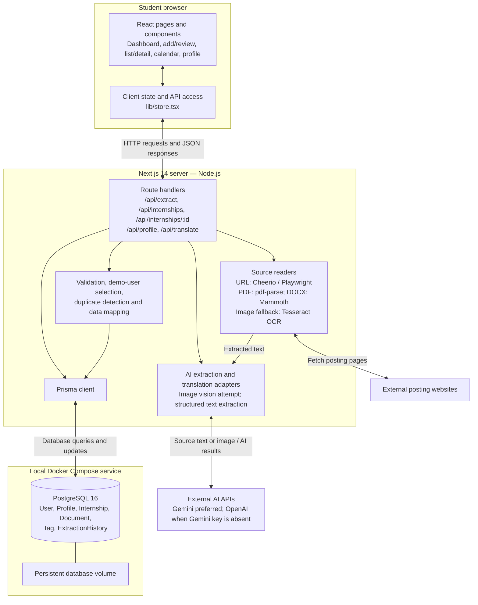

# D3 — InternTrack Architecture

Current implementation: one Next.js application with browser UI and server-side route handlers. Docker Compose supplies PostgreSQL locally; it does not deploy the complete application.

Image uploads first attempt AI vision; unusable or failed vision results fall back to OCR and text extraction. The diagram groups these branches into the extraction components rather than implying every upload uses OCR.

Translations are JSON on `Internship`, not a separate translation table. `Document` stores checklist metadata. Extraction history may exist without a saved internship. Credentials belong on the server; the browser does not connect directly to PostgreSQL or AI providers.

Production authentication and retention/deletion automation remain backlog work. This diagram documents structure, not certification that every security requirement has been implemented.

Evidence: `web/package.json`; `web/docker-compose.yml`; `web/prisma/schema.prisma`; `web/app/api/extract/route.ts`; `web/lib/ai/internshipExtractor.ts`; `web/lib/extractors/`.

Provider detail: structured text extraction selects Gemini when its key is present; otherwise it selects OpenAI. It does not automatically switch to OpenAI after a Gemini failure. Image vision uses Gemini.
