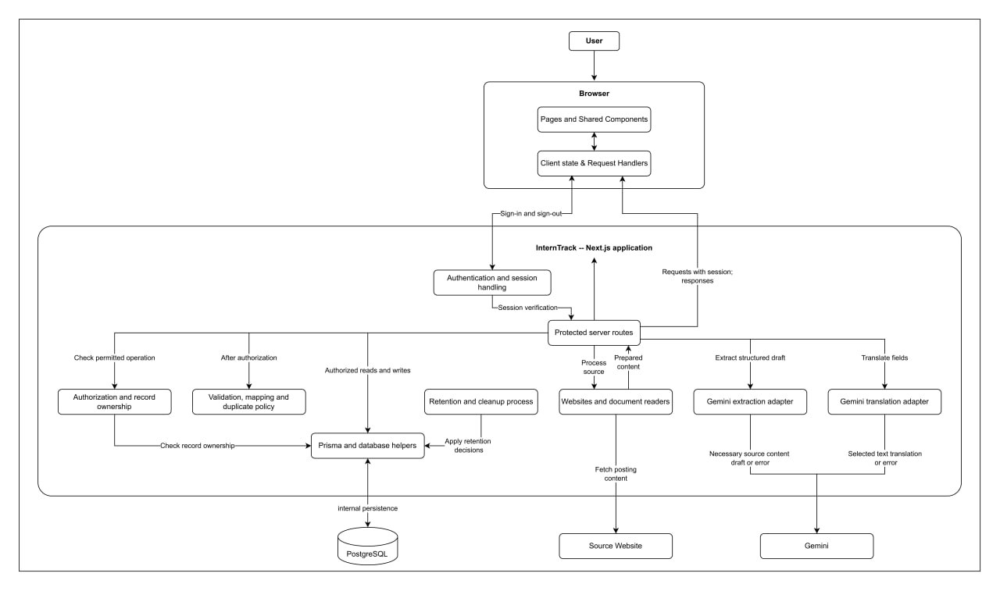

# D3 — High-Level Architecture

## Scope

This diagram describes the intended architecture of the whole system.

It includes the browser, authentication, server processing,
Gemini integration and database.

Implementation and verification status remain in the backlog.

## Architecture Diagram

## Component Responsibilities

### Browser

Provides sign-in, dashboard, list, capture/review, detail, calendar and profile screens.

Client handlers call server routes.
Credentials and database access remain server-side.

### Authentication and Authorization

- Verify sessions for protected requests.
- Reject invalid or expired sessions.
- Check ownership of records and related data.
- Handle sign-out and session invalidation.

The authentication method remains an implementation decision.
No external identity provider is assumed.

### Server Processing

- Validate requests and record references.
- Coordinate extraction and translation.
- Evaluate duplicate policy.
- Handle authorized reads and writes.
- Return clear success and failure responses.

### Source Readers

Process supported URLs, PDF, DOCX and image inputs.

Image processing may use vision or OCR.
The extraction route coordinates the relevant processing path.

### Gemini

Gemini is the sole AI provider.

- Prepare structured internship drafts.
- Translate supported fields.
- Receive only necessary content.
- Return results for validation and user review.

### Persistence

PostgreSQL stores profiles, internships, checklists, tags, extraction history and related translation data.

Use valid ownership relationships and consistent multi-step writes.

The authentication approach determines how account and session information is stored.

### Retention and Cleanup

Apply documented retention decisions to stored data.

Include failed, cancelled and orphaned extraction records.
Cleanup is a required capability, not a claim of implementation.

## Important Boundaries

- Protected operations require server-side authorization.
- External content and AI output are untrusted.
- Website fetching must restrict unsafe destinations.
- AI output remains a draft until explicitly saved after review.
- Failed persistence must not appear successful.
- Extraction history is separate from traffic/security logs.
- Deployment logging must follow applicable rules in `rule.md`.

Arrows show communication responsibilities.
They do not mean authorization is optional.
Detailed execution order belongs in D4.

## Traceability

- F1–F12: application pages, processing and persistence.
- F13: authentication and session access.
- NFR1–NFR4: reliability, validation, security and data quality.
- NFR5–NFR6: accessible and responsive browser UI.
- NFR7–NFR8: performance and maintainability.
- LR1–LR6, LR8: applicable data and operational controls.
- LR7: conditional acceptance/signature requirements outside current scope.

## Related Documents

- [Architecture overview](../architecture.md)
- [Specification](../../01-requirements/spec.md)
- [Backlog](../../01-requirements/backlog.md)
- [D1 system context](D1-system-context.md)
- [D2 use cases](D2-use-case.md)
- [D4 sequence](D4-activity.md)