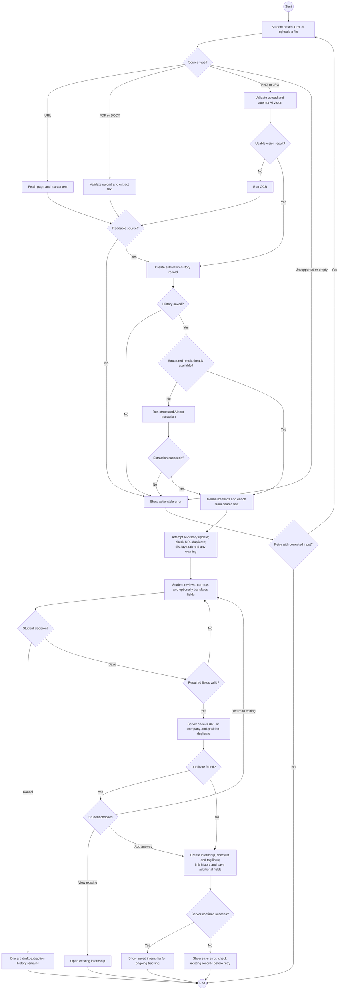

# D4 — Capture, Review and Save an Internship

The core automation extracts and structures a supplied posting. The student still initiates capture and reviews the result before saving.

The initial URL duplicate check provides early feedback; the save endpoint also checks duplicates unless the user explicitly overrides. Company and position are required. Uploads are limited to 10 MB in the extraction handler.

Persistence comprises multiple operations in the current save handler, not one enclosing transaction. A late failure can occur after the internship was created, so an error does not guarantee that nothing was saved. AI-history snapshot updates are best-effort. The diagram reflects these limits rather than promising atomic persistence.

Evidence: `web/app/api/extract/route.ts`; `web/app/api/internships/route.ts`; `.docs/01-requirements/spec.md` F2–F6.
