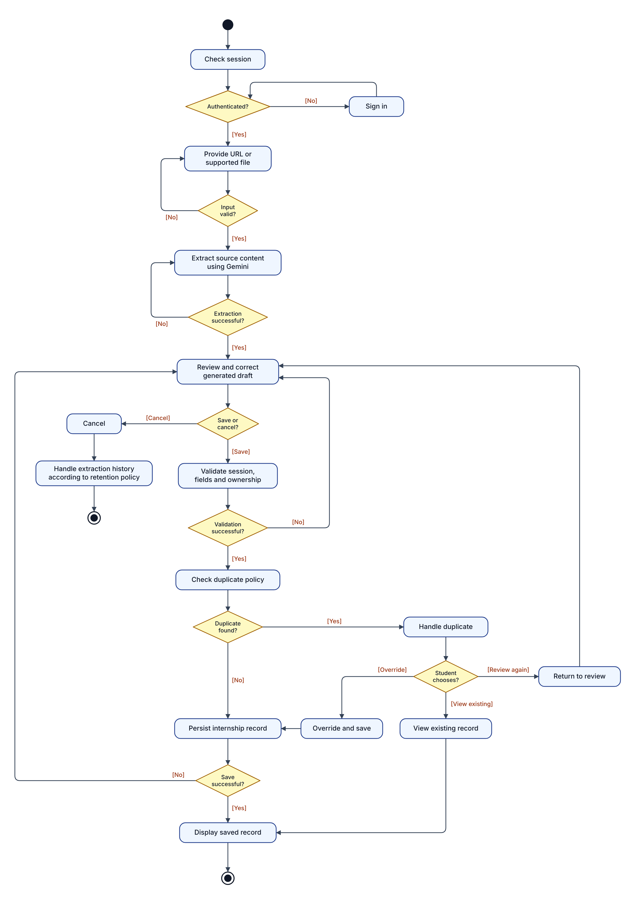

# D4 — Core Workflow Activity Diagram

## Scope

This diagram shows the whole system's core workflow:

Sign in → capture → extract → review → save → reopen.

It includes decisions, cancellation and failure paths.
Supporting workflows are described in the user journey and D2.

Implementation and acceptance status remain in the backlog.

## Activity Diagram

## Rules

- Protected actions require server-side session checks.
- Record references must belong to the authorized Student.
- Extraction creates a draft, not a saved internship.
- An extraction-time duplicate warning returns to review.
- Only an explicit final Save begins persistence.
- An override does not bypass validation or authorization.
- Failed operations must not appear successful.
- Retries must not create unintended duplicate records.
- Cancellation does not automatically delete extraction history.

## Supporting Workflows

Profile, tracking, checklist, calendar, search, translation and deletion follow the same authorization and error-handling rules.

They remain separate from this core activity flow.

## Traceability

- F2–F3: Capture and extraction.
- F4: Review and cancellation.
- F5: Save and reopen.
- F6: Duplicate decisions.
- F13: Authentication and session access.
- NFR1–NFR3: Reliability, validation and security.
- LR2: External AI processing.
- LR4: Ownership.
- LR8: Retention.

## Notation

- Filled circle: start.
- Rounded rectangle: action.
- Diamond: decision.
- Labeled arrows: decision outcomes.
- Double-circle approximation: end.

Mermaid flowchart shapes approximate an activity diagram.
Use a dedicated UML tool if exact UML notation is required.

## Related Documents

- [Specification](../../01-requirements/spec.md)
- [User journey](../user-journey.md)
- [D2 use cases](D2-use-case.md)
- [D3 architecture](D3-architecture.md)