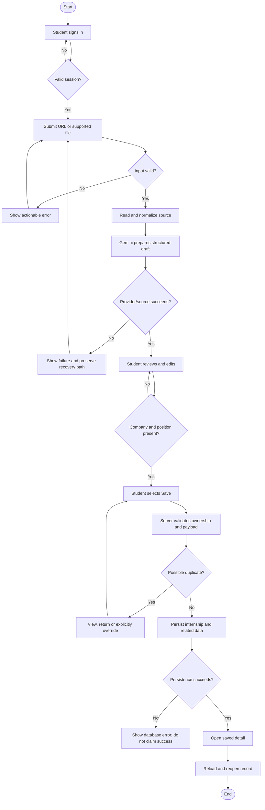

# Core Activity Diagram

```mermaid
flowchart TD
  A([Start]) --> B[Student signs in]
  B --> C{Valid session?}
  C -- No --> B
  C -- Yes --> D[Submit URL or supported file]
  D --> E{Input valid?}
  E -- No --> F[Show actionable error]
  F --> D
  E -- Yes --> G[Read and normalize source]
  G --> H[Gemini prepares structured draft]
  H --> I{Provider/source succeeds?}
  I -- No --> J[Show failure and preserve recovery path]
  J --> D
  I -- Yes --> K[Student reviews and edits]
  K --> L{Company and position present?}
  L -- No --> K
  L -- Yes --> M[Student selects Save]
  M --> N[Server validates ownership and payload]
  N --> O{Possible duplicate?}
  O -- Yes --> P[View, return or explicitly override]
  P --> M
  O -- No --> Q[Persist internship and related data]
  Q --> R{Persistence succeeds?}
  R -- No --> S[Show database error; do not claim success]
  R -- Yes --> T[Open saved detail]
  T --> U[Reload and reopen record]
  U --> V([End])
```
