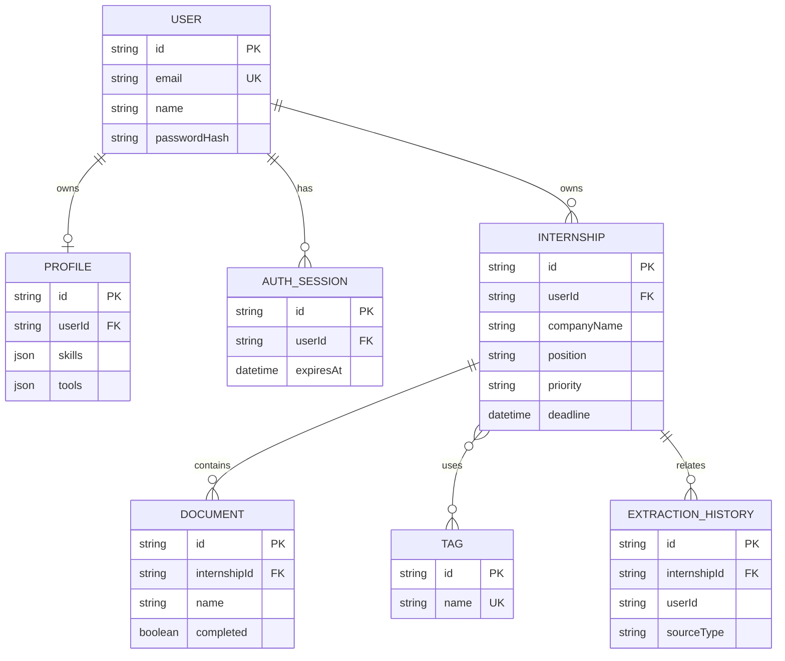

# InternTrack Entity-Relationship Diagram

```mermaid
erDiagram
  USER ||--o| PROFILE : owns
  USER ||--o{ AUTH_SESSION : has
  USER ||--o{ INTERNSHIP : owns
  INTERNSHIP ||--o{ DOCUMENT : contains
  INTERNSHIP }o--o{ TAG : uses
  INTERNSHIP ||--o{ EXTRACTION_HISTORY : relates

  USER {
    string id PK
    string email UK
    string name
    string passwordHash
  }
  PROFILE {
    string id PK
    string userId FK
    json skills
    json tools
  }
  AUTH_SESSION {
    string id PK
    string userId FK
    datetime expiresAt
  }
  INTERNSHIP {
    string id PK
    string userId FK
    string companyName
    string position
    string priority
    datetime deadline
  }
  DOCUMENT {
    string id PK
    string internshipId FK
    string name
    boolean completed
  }
  TAG {
    string id PK
    string name UK
  }
  EXTRACTION_HISTORY {
    string id PK
    string internshipId FK
    string userId
    string sourceType
  }
```

Source: [schema.prisma](../../web/prisma/schema.prisma).
