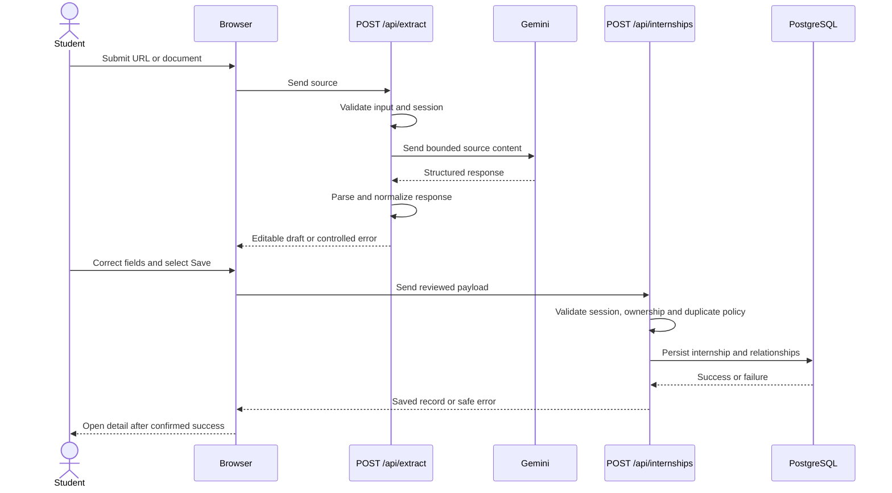

# Core Sequence Diagram

```mermaid
sequenceDiagram
  actor Student
  participant Browser
  participant ExtractRoute as POST /api/extract
  participant Gemini
  participant InternshipRoute as POST /api/internships
  participant DB as PostgreSQL

  Student->>Browser: Submit URL or document
  Browser->>ExtractRoute: Send source
  ExtractRoute->>ExtractRoute: Validate input and session
  ExtractRoute->>Gemini: Send bounded source content
  Gemini-->>ExtractRoute: Structured response
  ExtractRoute->>ExtractRoute: Parse and normalize response
  ExtractRoute-->>Browser: Editable draft or controlled error
  Student->>Browser: Correct fields and select Save
  Browser->>InternshipRoute: Send reviewed payload
  InternshipRoute->>InternshipRoute: Validate session, ownership and duplicate policy
  InternshipRoute->>DB: Persist internship and relationships
  DB-->>InternshipRoute: Success or failure
  InternshipRoute-->>Browser: Saved record or safe error
  Browser-->>Student: Open detail after confirmed success
```
