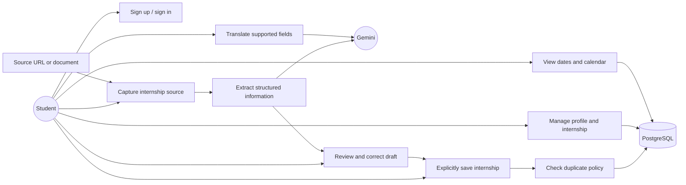

# InternTrack Use-Case Diagram

```mermaid
flowchart LR
  Student((Student))
  AI((Gemini))
  DB[(PostgreSQL)]
  Source[Source URL or document]

  Student --> SignIn[Sign up / sign in]
  Student --> Capture[Capture internship source]
  Student --> Review[Review and correct draft]
  Student --> Save[Explicitly save internship]
  Student --> Manage[Manage profile and internship]
  Student --> Calendar[View dates and calendar]
  Student --> Translate[Translate supported fields]

  Capture --> Extract[Extract structured information]
  Extract --> AI
  Extract --> Review
  Review --> Save
  Save --> Duplicate[Check duplicate policy]
  Duplicate --> DB
  Manage --> DB
  Calendar --> DB
  Translate --> AI
  Source --> Capture
```

This diagram describes the intended boundaries. It does not claim that every
use case has passed acceptance testing.
